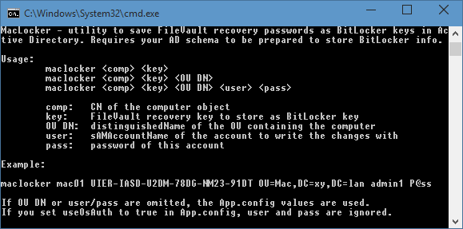
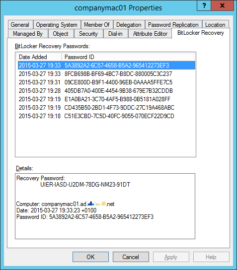

# MacLocker

## What is it

It's a utility to save FileVault recovery keys as BitLocker passwords in Active Directory

## Usage

## Result

FileVault with Active Directory

Remember storing BitLocker passwords in Active Directory? Wouldn’t it be great if you could store OS X FileVault keys the same way? Well, actually, you can. Not out-of-box, but technically nothing is in the way of doing just that – it’s just a bunch of characters.

So I decided to create a simple utility for this task. It simply adds a BitLocker recovery password entry to the specified computer object in AD, except this entry is of course a FileVault key this time. The utility’s called MacLocker and this is what it looks like:

Of course, for this to work, you need to join the Mac computer to the domain, otherwise there’d be no computer object to add the recovery key to. The internet’s full of tutorials covering this procedure, but trust me, it’s simple. Just make sure to enable mobile accounts, otherwise the user won’t be able to login when roaming.

After you’ve successfully added your FileVault keys to the domain-joined computer, you can conveniently browse through them from Active Directory Users and Computers:

Enjoy!
